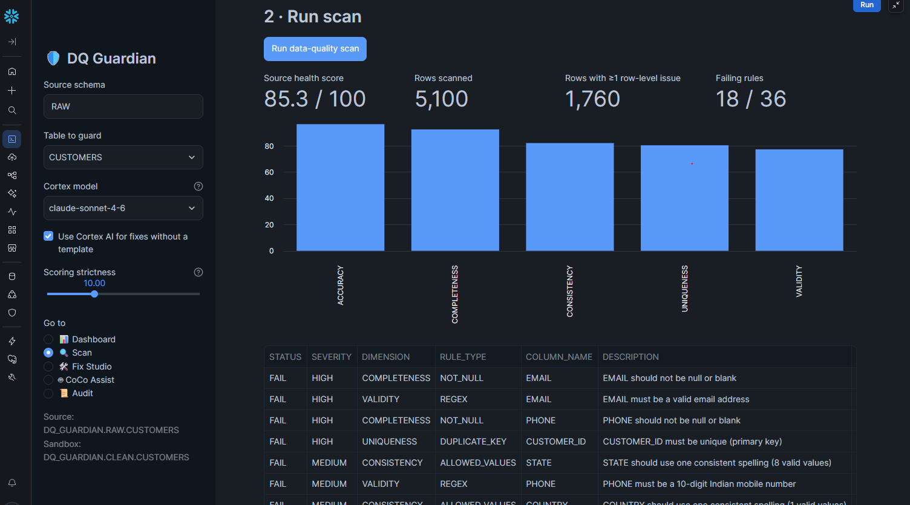
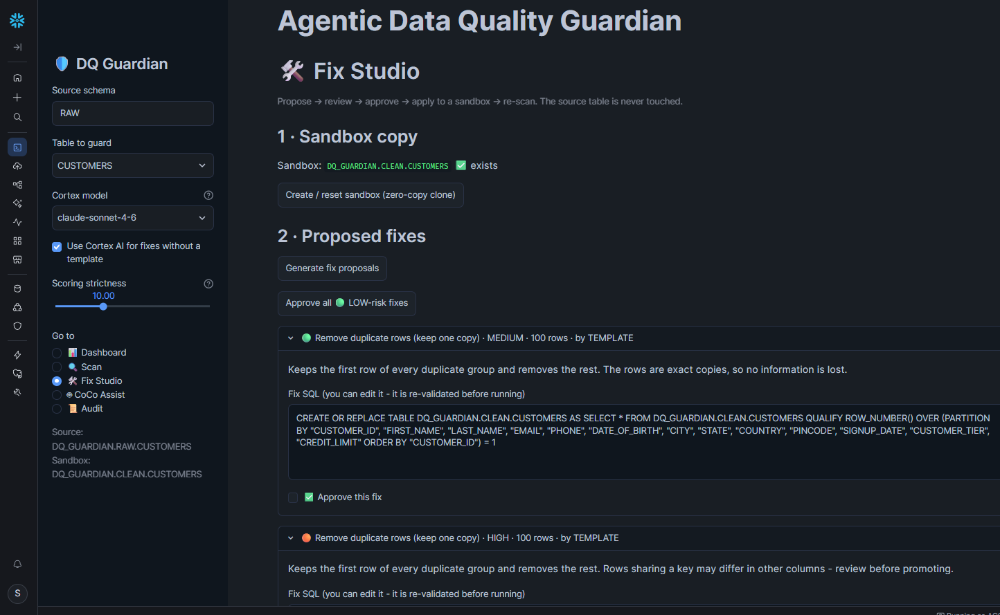
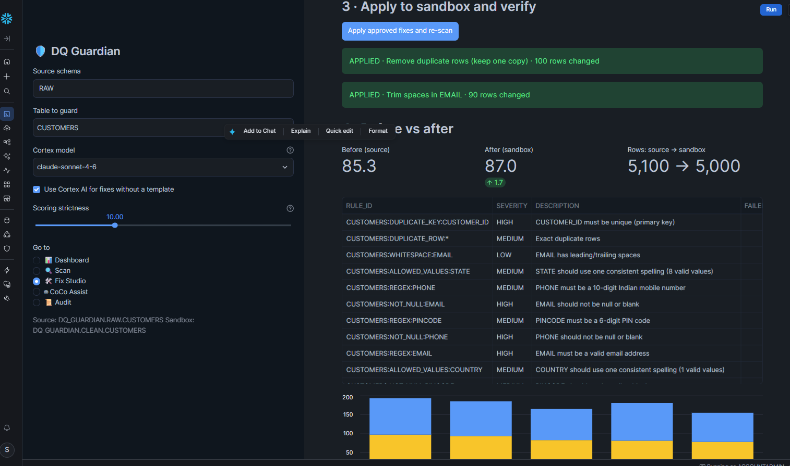
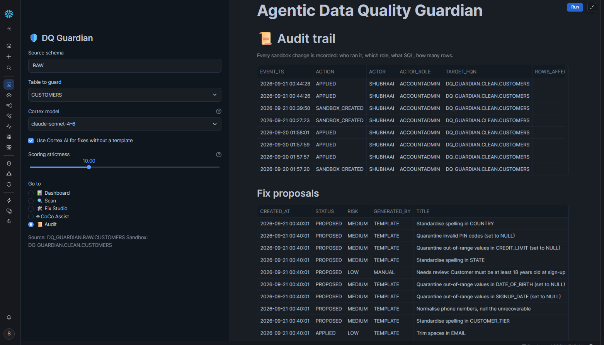
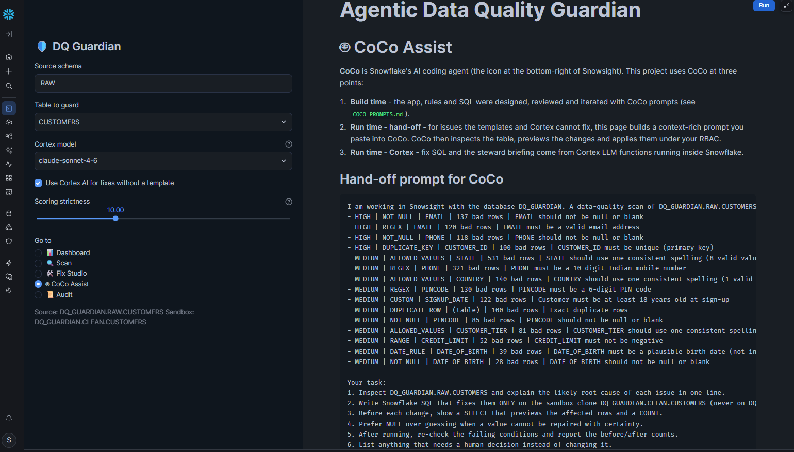
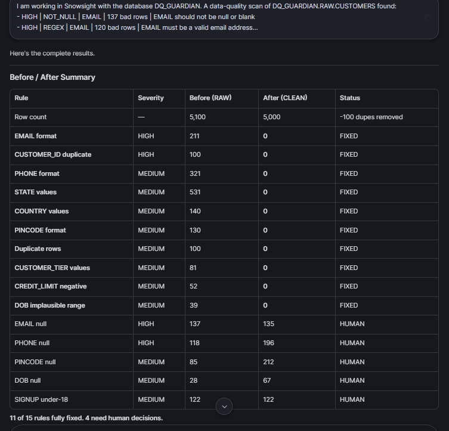

# Agentic Data Quality Guardian

A Streamlit-in-Snowflake app that scans a table for data quality problems, proposes fixes, and applies the ones you approve to a sandbox copy. The original table is never modified.

Built for CoCoQuest 2026 (Theme 1) with Snowflake, Streamlit, Cortex AI and CoCo.

## What it does

1. **Discover.** Profiles a table and writes its own quality rules: blanks, formats, spelling variants, duplicates, outliers, and links between tables.
2. **Scan.** Runs the rules and gives the table a health score from 0 to 100.
3. **Propose.** Suggests a fix for every failing rule. Common problems use fixed recipes; the rest are sent to Snowflake Cortex.
4. **Approve.** Nothing runs until you tick approve. Every SQL statement passes a guardrail first.
5. **Apply and verify.** Approved fixes run on a zero-copy clone, the clone is scanned again, and you see before and after.
6. **Audit.** Every change is written to a log table.

For problems no recipe can handle, the app builds a prompt from the scan results that you can paste into CoCo.

## Screenshots

**Scan of the raw CUSTOMERS table**



**Fix Studio with a proposed fix**



**Before and after applying fixes to the sandbox**



**Audit trail**



**CoCo Assist page with the generated hand-off prompt**



**CoCo working on the sandbox with that prompt**



## Results

These are from a run on the demo data in this repository.

| Step | Result |
|---|---|
| Scan of `CUSTOMERS` | 85.3 out of 100, 5,100 rows scanned, 1,760 rows with an issue, 18 of 36 rules failing |
| Two fixes applied in Fix Studio (remove duplicates, trim spaces in EMAIL) | 87.0 out of 100, rows 5,100 to 5,000 |
| Hand-off prompt run in CoCo on the sandbox | 11 of 15 rules fully fixed, 4 left for a human decision |

## Repository layout

```
dq-guardian-cocoquest/
├── README.md
├── COCO_PROMPTS.md          prompts to paste into CoCo
├── LICENSE
├── sql/
│   └── 01_setup.sql         database, metadata tables and demo data
├── app/
│   └── streamlit_app.py     the Streamlit app
└── docs/
    ├── screenshots/         images used in this README
    └── Agentic_Data_Quality_Guardian.pdf    presentation deck
```

## Terms

| Term | Meaning |
|---|---|
| Snowsight | Snowflake's web interface |
| Warehouse | The compute that runs queries |
| Cortex AI | Snowflake's built-in AI functions; they run inside Snowflake |
| CoCo | Snowflake's AI coding assistant, opened from the icon at the bottom right of Snowsight |
| Sandbox clone | A zero-copy copy of a table where fixes are applied |
| Guardrail | A check that blocks unsafe SQL before it runs |

## Requirements

- A Snowflake account (a free trial works)
- A role that can create a database and a warehouse, such as `ACCOUNTADMIN`
- Cortex AI in your region is optional. Without it the app still works and uses the fix recipes only.

## Setup

**1. Create the database and demo data**

Open a SQL worksheet in Snowsight, set the role to `ACCOUNTADMIN`, paste the contents of `sql/01_setup.sql`, and choose **Run All**. Then check the row counts:

```sql
SELECT COUNT(*) FROM DQ_GUARDIAN.RAW.CUSTOMERS;
SELECT COUNT(*) FROM DQ_GUARDIAN.RAW.ORDERS;
```

You should get 5100 and 12000.

**2. Check Cortex (optional)**

```sql
SELECT AI_COMPLETE('llama3.1-70b', 'Reply with exactly: Cortex is working');
```

If it fails, try another model such as `mistral-large2`. If your role lacks access:

```sql
GRANT DATABASE ROLE SNOWFLAKE.CORTEX_USER TO ROLE ACCOUNTADMIN;
```

If models are not available in your region, an account admin can allow cross-region inference:

```sql
ALTER ACCOUNT SET CORTEX_ENABLED_CROSS_REGION = 'ANY_REGION';
```

**3. Create the Streamlit app**

In Snowsight, create a new Streamlit app in the database `DQ_GUARDIAN`, schema `DQ`, using the warehouse `DQ_GUARDIAN_WH`. Replace the sample code with the contents of `app/streamlit_app.py` and click **Run**. Use the same role that ran the setup script.

**4. Use the app**

1. **Scan** page: choose the table in the sidebar, click *Discover rules from data profile*, then *Run data-quality scan*.
2. **Fix Studio** page: click *Create / reset sandbox*, then *Generate fix proposals*. Open the cards, approve the fixes you agree with, then click *Apply approved fixes and re-scan*.
3. **CoCo Assist** page: copy the generated prompt into the CoCo panel.
4. **Audit** page: review what was changed.

## Demo data

`01_setup.sql` generates two tables with deliberate problems, so there is something to find.

`CUSTOMERS` (5,100 rows): 100 exact duplicates, missing and malformed emails, phone numbers that are too short or carry a `+91-` prefix, impossible birth dates, state and country spelled several ways, PIN codes with the wrong length, sign-ups before age 18, negative and extreme credit limits.

`ORDERS` (12,000 rows): orders for customers that do not exist, negative quantities, missing prices, totals that do not match quantity times price, ship dates before order dates, status typos, a few prices 100 times too high.

The data is generated with SQL inside Snowflake, so nothing needs to be downloaded.

## How the score works

Each rule scores `1 - (share of bad rows x strictness)`, never below 0. The health score is the weighted average of all rule scores; high-severity rules count 3 times, medium 2 times, low once. The strictness slider (default 10) exists because most rules pass, so a plain average would make dirty data look clean.

Rules are grouped into six dimensions: completeness, uniqueness, validity, consistency, integrity and accuracy.

## Safety

- Fixes run on a clone in the `CLEAN` schema. The `RAW` table is never written to.
- A person approves every fix.
- The guardrail allows only `UPDATE`, `DELETE FROM` and `CREATE OR REPLACE TABLE ... AS SELECT` on the sandbox table. It rejects `DROP`, `TRUNCATE`, `GRANT`, `ALTER`, comments and chained statements, when a fix is generated, when it is edited, and again when it runs.
- Table values shown to the AI are marked as data, not instructions.
- Values that cannot be repaired are set to NULL instead of guessed.
- Each applied fix is logged in `DQ.FIX_AUDIT_LOG` with user, role, SQL and row counts.

## Limitations

- Rules are inferred from column names and value frequencies, so review them on the Scan page.
- Phone and PIN code patterns are for India. Change `PHONE_RE` and `PIN_RE` in `app/streamlit_app.py` for other countries.
- Setting invalid values to NULL improves validity but lowers completeness.
- Deleting orphan rows is high risk and should only be approved after checking them.
- Cortex model availability depends on the region. The app tries several models in turn.

## Built with

Snowflake, Streamlit in Snowflake, Snowflake Cortex (`AI_COMPLETE`), and CoCo. The code was written with AI assistance and then run, tested and reviewed on a Snowflake account. CoCo was used in Snowsight to profile the tables and to fix the sandbox from the app's hand-off prompt (see the screenshots above).

## Clean up

```sql
DROP DATABASE IF EXISTS DQ_GUARDIAN;
DROP WAREHOUSE IF EXISTS DQ_GUARDIAN_WH;
```
